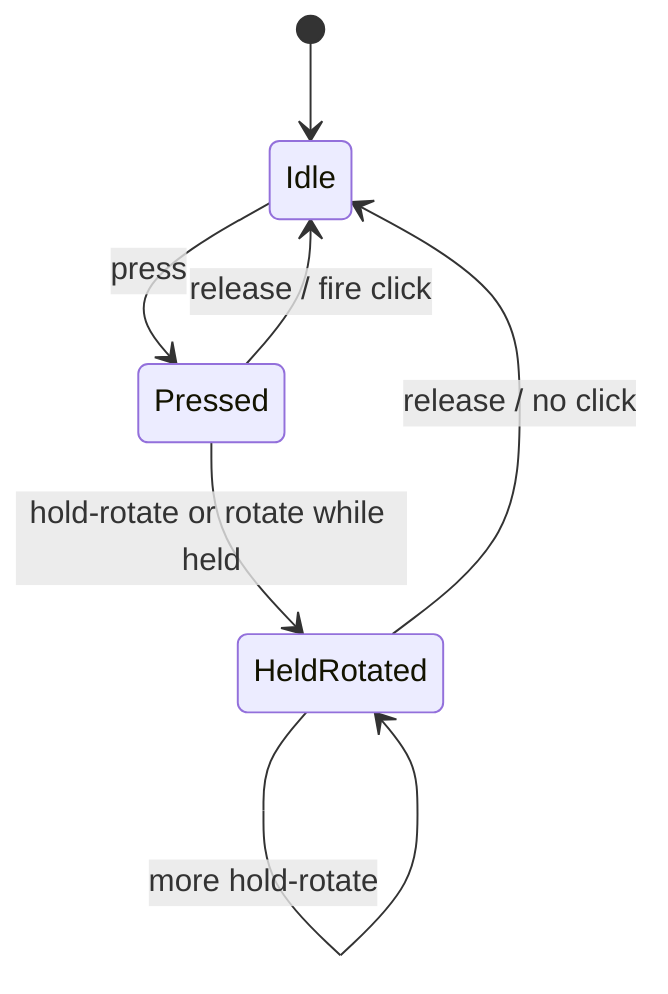

# Encoder Hold-and-Rotate - Plan

## Goal Capsule

- **Objective:** A D200X user can bind a different action to turning a knob while holding it than to turning it freely, and releasing after that turn does not also run the click.
- **Means:** Parse hold-rotate HID values as pressed rotate events, add per-encoder press-rotate bindings, and delay encoder click until release (KTD1, KTD2, KTD4).
- **Authority:** Product Contract owns behavior. Planning Contract KTDs own mechanism. Units cite R/KTD IDs and do not invent product rules. GitHub issue #4 is HID evidence, not authority over confirmed scope.
- **Stop:** Do not expand to other devices, encoder display, or a coalesce rewrite. Do not keep press-edge encoder click.
- **Execution:** code. Four units. Protocol, then config, then service, then docs.
- **Tail:** D200X config authors and issue #4.

---

## Product Contract

### Summary

Support D200X knob hold-and-rotate as a first-class gesture. Parse the distinct pressed-rotate HID values. Let each encoder bind separate actions for press-rotate versus free rotate. Document the new bindings and the click-on-release change.

### Problem Frame

Encoder knobs already click and turn. The D200X also emits distinct HID packets when the user turns a knob while holding it down. The daemon treats those packets as unknown, so the gesture cannot be mapped. Click currently fires on press-down, so a hold-rotate would also click.

### Key Decisions

- Encoder click waits until release and is cancelled if the knob rotated while held (session-settled: user-approved — chosen over keep click-on-press: hold-rotate would also fire the click). Governs R5, R6, R7.
- Unmapped hold-rotate falls through to the normal rotate actions (session-settled: user-approved — chosen over silent unless explicitly bound). Governs R8, R9, R10.

### Requirements

**Protocol**

- R1. HID value `0x04` is hold-rotate counter-clockwise. HID value `0x05` is hold-rotate clockwise. Direction matches the existing `ENCODER_VALUE_ROTATE_CCW` / `ENCODER_VALUE_ROTATE_CW` constants and protocol tests, not the inverted header comments.
- R2. Those packets become rotate events with pressed true. They are not unknown.

**Config**

- R3. Each encoder may bind optional press-rotate clockwise and counter-clockwise actions.
- R4. Existing encoder tables without those keys still load.

**Click**

- R5. Encoder click fires on release when no rotate occurred while held.
- R6. Any rotate while the knob is held cancels the pending click. Cancel happens on the rotate packet, not after coalesce flush.
- R7. Click-on-release applies even when press-rotate bindings are absent.

**Fallthrough**

- R8. If the matching press-rotate action is unset, that direction uses the free-rotate action.
- R9. An explicit noop action is bound. It silences that direction and does not fall through.
- R10. Unmapped is per-direction. Binding only clockwise press-rotate does not silence counter-clockwise hold-rotate.

**Coalesce**

- R11. Hold-rotate uses the same coalesce window and repeat-N-times dispatch as free rotate.
- R12. Hold pulses and free pulses do not share one accumulator.

**Docs**

- R13. README and the example config show press-rotate bindings, click-on-release, cancel-if-rotated, and fallthrough.

### Key Flows

- F1. Click with no turn
  - **Trigger:** Press then release. No hold-rotate packets.
  - **Steps:** Arm click on press. Fire `on_press` on release.
  - **Covered by:** R5, R7
- F2. Hold-rotate with bindings
  - **Trigger:** Press, one or more hold-rotate packets, release.
  - **Steps:** Arm click. On first hold-rotate packet cancel click. Dispatch the press-rotate action after coalesce. Release is silent.
  - **Covered by:** R2, R3, R6, R11
- F3. Unmapped hold-rotate
  - **Trigger:** Press and turn while held. Matching press-rotate action unset. Free-rotate action set.
  - **Steps:** Cancel click. Dispatch the free-rotate action.
  - **Covered by:** R6, R8
- F4. Free rotate
  - **Trigger:** Turn without holding.
  - **Steps:** Dispatch free-rotate actions. Click is not involved.
  - **Covered by:** R11, R12
- F5. Click then later free rotate
  - **Trigger:** Press, release, then free rotate.
  - **Steps:** Click on release. Later free rotate is independent.
  - **Covered by:** R5

### Acceptance Examples

- AE1. Mute click
  - **Covers:** F1, R5
  - **Given:** Encoder 0 has `on_press` mute.
  - **When:** Press then release with no turn.
  - **Then:** Mute runs once on release. Not on press-down.
- AE2. Bound hold-rotate
  - **Covers:** F2, R6
  - **Given:** Encoder 0 has mute on press and a press-rotate CW action.
  - **When:** Press, hold-rotate CW, release.
  - **Then:** Press-rotate CW runs. Mute does not.
- AE3. Fallthrough volume
  - **Covers:** F3, R8
  - **Given:** Encoder 0 has mute on press and volume on free rotate. No press-rotate keys.
  - **When:** Press, hold-rotate CW, release.
  - **Then:** Volume-up runs. Mute does not.
- AE4. Explicit noop
  - **Covers:** R9
  - **Given:** Press-rotate CW is noop. Free rotate CW is volume-up.
  - **When:** Press, hold-rotate CW, release.
  - **Then:** Neither volume-up nor click runs.
- AE5. Per-direction unmapped
  - **Covers:** R10
  - **Given:** Press-rotate CW is bound. Press-rotate CCW is unset. Free rotate CCW is bound.
  - **When:** Press and hold-rotate CCW.
  - **Then:** Free-rotate CCW runs.

### Success Criteria

- A user can copy the example encoder table and get click, free rotate, and press-rotate as three distinct gestures without a hold-rotate also clicking.

### Scope Boundaries

- D200X only. Other devices are out.
- Encoder display and wide-tile UX are out.
- Coalesce timing and repeat-N-times dispatch stay. Split held versus free buckets is in. A sliding debounce or delta-passing rewrite is out.
- `ulanzi-niri sniff` streaming unlock is out.

#### Deferred to Follow-Up Work

- Send `ENABLE_INPUT_STREAMING` from `ulanzi-niri sniff` so hold-rotate packets are visible without the daemon.
- Capture encoder mapping at press instead of reading the live page, if mid-hold page switches prove painful.
- Encoder long-press, deadzone, or bump-tolerant click.

### Sources

- GitHub issue #4 (HID `0x04` / `0x05` capture and proposed product shape).
- `src/ulanzi_niri/protocol/ulanzi_d200x.py` encoder constants and marker `0x02` parse.
- `src/ulanzi_niri/service.py` encoder press, rotate, and flush handlers.
- Button long-press in `src/ulanzi_niri/service.py` as the closest release-unless-gesture pattern.

---

## Planning Contract

### Key Technical Decisions

- KTD1. **Parse hold-rotate as pressed rotate events.** Use the existing rotate kind with pressed true. Do not add a new event kind. Set pressed false on free-rotate events so hold is not inferred from a missing flag.
- KTD2. **Name the config keys `on_press_rotate_cw` and `on_press_rotate_ccw`.** Compose from existing `on_press` and `on_rotate_*` names. Matches issue #4. `EncoderEntry` forbids unknown keys, so the fields must be declared. Defaults stay unset.
- KTD3. **Split coalesce buckets by encoder index and held.** Keep the existing first-event-starts-timer window and repeat-N-times flush. One signed accumulator per index cannot choose press-rotate versus free rotate when both occur inside the window.
- KTD4. **Cancel the pending click on the first rotate-while-held packet.** (session-settled: user-approved — chosen over keep click-on-press: hold-rotate would also fire the click) per R5, R6, R7. Flush is too late. A press, rotate, and release inside one coalesce window would still click.
- KTD5. **Fall through per direction. Treat explicit noop as bound.** (session-settled: user-approved — chosen over silent unless explicitly bound) per R8, R9, R10.
- KTD6. **Resolve the encoder mapping from the live current page at dispatch.** Matches buttons and today's rotate flush. A mid-hold page switch can swallow the rest of the gesture.
- KTD7. **Classify hold versus free from the HID value.** Do not require a prior press packet to treat `0x04` / `0x05` as hold. Still arm click on press so a missing press cannot invent a click.
- KTD8. **Use ActionContext sources `encoder:{index}:press_cw` and `encoder:{index}:press_ccw`.** Keep the existing `encoder:{index}:press|cw|ccw` pattern.

### High-Level Technical Design

Directional guidance, not implementation specification.

```mermaid
flowchart TB
  hid[HID IN_BUTTON marker 0x02]
  parse[D200X parse]
  pressEvt[Press or release event]
  rotEvt[Rotate event with pressed flag]
  svc{Service}
  click[Click on release unless cancelled]
  holdFlush[Held coalesce bucket]
  freeFlush[Free coalesce bucket]
  hid --> parse
  parse --> pressEvt
  parse --> rotEvt
  pressEvt --> svc
  rotEvt --> svc
  svc --> click
  svc --> holdFlush
  svc --> freeFlush
```



### Risks

- Click-on-release is a breaking UX change for every existing encoder `on_press`, including mute on encoder 0 in `examples/config.toml`. Document it in U4.
- Protocol header comments invert CW and CCW versus constants and tests. Follow constants. Fix comments in U1.
- Firmware is assumed to emit a release after a held click. Comments and tests already describe press and release for click. If a device omits release, click never fires.
- Mixing hold and free in one 50ms window is the normal case on a volume knob. KTD3 is required, not optional.

---

## Implementation Units

### U1. Parse hold-rotate HID values

- **Goal:** Hold-rotate packets become pressed rotate events instead of unknown.
- **Requirements:** R1, R2
- **Dependencies:** none
- **Files:** `src/ulanzi_niri/protocol/ulanzi_d200x.py`, `tests/test_protocol.py`
- **Approach:**
  1. Add hold-rotate value constants next to the existing encoder values.
  2. In the marker `0x02` parse branch, map those values to rotate events with delta ±1 and pressed true.
  3. Set pressed false on free-rotate events (KTD1).
  4. Fix the header comments so `0x02` is CCW and `0x03` is CW, matching constants and tests. Document `0x04` / `0x05` as the held pair (R1).
- **Execution note:** Add the `0x04` / `0x05` parse tests before changing the ladder. Unknown-marker tests should stay unknown.
- **Patterns to follow:** Existing encoder press and free-rotate cases in `ulanzi_d200x.py` and `tests/test_protocol.py`. Synthetic `_button_packet` helpers. Do not open HID.
- **Test scenarios:**
  - Packet value `0x05` on encoder wire index 17 yields rotate, encoder 0, delta 1, pressed true.
  - Packet value `0x04` on encoder wire index 19 yields rotate, encoder 2, delta -1, pressed true.
  - Packet value `0x03` still yields rotate CW with pressed false.
  - Packet value `0x02` still yields rotate CCW with pressed false.
  - Press `0x01` and release `0x00` still yield press events with pressed true then false.
  - Unknown marker still yields unknown. Encoder values other than the six known ones still yield unknown.
- **Verification:** Protocol tests cover the six encoder values and still reject unknown markers. Header comments agree with constants.

### U2. Encoder press-rotate config fields

- **Goal:** Config can name press-rotate actions without breaking existing tables.
- **Requirements:** R3, R4
- **Dependencies:** none
- **Files:** `src/ulanzi_niri/config.py`, `tests/test_config.py`
- **Approach:**
  1. Add optional `on_press_rotate_cw` and `on_press_rotate_ccw` on `EncoderEntry` (KTD2). Same `Action | None` shape as `on_rotate_cw`.
  2. Do not add a new action type.
- **Patterns to follow:** `EncoderEntry` optional actions and `extra="forbid"`. `tests/test_config.py` `_load` helper and `test_example_config_parses`.
- **Test scenarios:**
  - Encoder table with both new keys loads and preserves the actions.
  - Encoder table without the new keys still loads. Fields default unset (R4).
  - Unknown encoder key still fails validation.
  - Example `examples/config.toml` still parses.
- **Verification:** Config tests pass. Example config still loads.

### U3. Encoder click delay, cancel, and hold-rotate dispatch

- **Goal:** Service implements click-on-release, cancel-if-rotated, split coalesce, and fallthrough.
- **Requirements:** R5, R6, R7, R8, R9, R10, R11, R12
- **Dependencies:** U1, U2
- **Files:** `src/ulanzi_niri/service.py`, `tests/test_service.py`, `src/ulanzi_niri/actions/__init__.py`
- **Approach:**
  1. Track per-encoder press and rotated-while-held. Do not reuse button `_press_state`. It is keyed by LCD pos.
  2. On press, arm click. Do not dispatch.
  3. On release, dispatch `on_press` only when armed and not rotated-while-held (KTD4, R5, R7).
  4. On rotate with pressed true, mark rotated-while-held and accumulate into the held bucket (KTD3, KTD7).
  5. On rotate with pressed false, accumulate into the free bucket.
  6. Flush held and free separately with the existing coalesce window and repeat-N-times loop (R11, R12).
  7. Held flush picks press-rotate action, else free-rotate action, else nothing. Noop is bound and does not fall through (KTD5).
  8. Look up `EncoderEntry` from the live current page (KTD6).
  9. Set ActionContext sources per KTD8. Update the source-string comment in `actions/__init__.py` if it lists the old set.
- **Execution note:** Characterize today's press-edge click with a failing test before moving dispatch to release. Encoder service has no tests today. Inject config by patching `load_config`. Set coalesce to 0 or await the flush task.
- **Technical design:** Directional only. Independent knobs keep independent arm and accum state. A free pulse and a hold pulse on the same index in one window flush to different actions. Cancel click as soon as a hold-rotate packet arrives, even if held delta later nets to zero.
- **Patterns to follow:** Button long-press release path in `service.py` (fire `on_press` on release iff the other gesture did not fire). Existing `_on_encoder_rotate` / `_flush_encoder` coalesce. `tests/test_service.py` config injection.
- **Test scenarios:**
  - Covers AE1. Press then release with no rotate dispatches `on_press` once on release, not on press-down.
  - Covers AE2. Press, hold-rotate CW, release dispatches press-rotate CW and not `on_press`.
  - Covers AE3. Press, hold-rotate CW, no press-rotate binding, free-rotate CW set, dispatches free-rotate CW and not `on_press`.
  - Covers AE4. Press-rotate CW is noop. Hold-rotate CW dispatches nothing and does not fall through.
  - Covers AE5. Only press-rotate CW bound. Hold-rotate CCW uses free-rotate CCW.
  - Click-on-release still applies when no press-rotate keys exist (R7).
  - Free rotate with no press does not cancel a later click on a different press cycle.
  - Two encoders: hold on 0 does not cancel click on 1.
  - Hold pulse and free pulse in one coalesce window dispatch the matching actions, not a mixed delta.
  - Missing `[[page.encoder]]` for that index is a silent no-op for press, hold-rotate, and click.
  - Page with no encoder table: in-flight release after a page switch does not fire the previous page's `on_press`.
- **Verification:** New service encoder tests cover AE1–AE5 plus split-bucket and missing-encoder cases. Existing service tests still pass.

### U4. Document bindings and click-on-release

- **Goal:** Users can copy a working press-rotate example and know that click moved to release.
- **Requirements:** R13
- **Dependencies:** U2
- **Files:** `README.md`, `examples/config.toml`
- **Approach:**
  1. Document that encoders support click, free rotate, and press-rotate.
  2. State that click fires on release and is cancelled if the knob turned while held.
  3. State that unset press-rotate keys fall through to free rotate.
  4. Add press-rotate bindings on one example encoder. Keep mute as click. Volume as free rotate. A distinct media or niri action as press-rotate.
- **Patterns to follow:** Existing `[[page.encoder]]` tables in `examples/config.toml`. README Hardware and config tone.
- **Test expectation:** none -- documentation and example config only. Example parse coverage stays in U2.
- **Verification:** README names click-on-release, cancel, fallthrough, and the new keys. Example encoder table includes press-rotate and still matches `EncoderEntry`.

---

## Verification Contract

- Protocol, service, and config tests for this change: `uv run pytest tests/test_protocol.py tests/test_service.py tests/test_config.py`
- Full suite: `uv run pytest`
- Lint: `uv run ruff check .`
- Types: `uv run mypy src`

U1 is proven by protocol packet tests. U2 is proven by config parse tests including the example file. U3 is proven by service encoder tests covering AE1–AE5. U4 is proven by README and example review plus U2's example parse.

---

## Definition of Done

- R1–R13 are implemented and traced from U1–U4.
- AE1–AE5 pass via U3 tests.
- Click no longer fires on encoder press-down.
- Unmapped hold-rotate uses free-rotate actions. Explicit noop does not.
- Hold and free coalesce do not mix in one window.
- README and `examples/config.toml` describe the new gesture and the breaking click change.
- `uv run pytest`, `uv run ruff check .`, and `uv run mypy src` pass.
- Abandoned-attempt code is not left in the diff.
