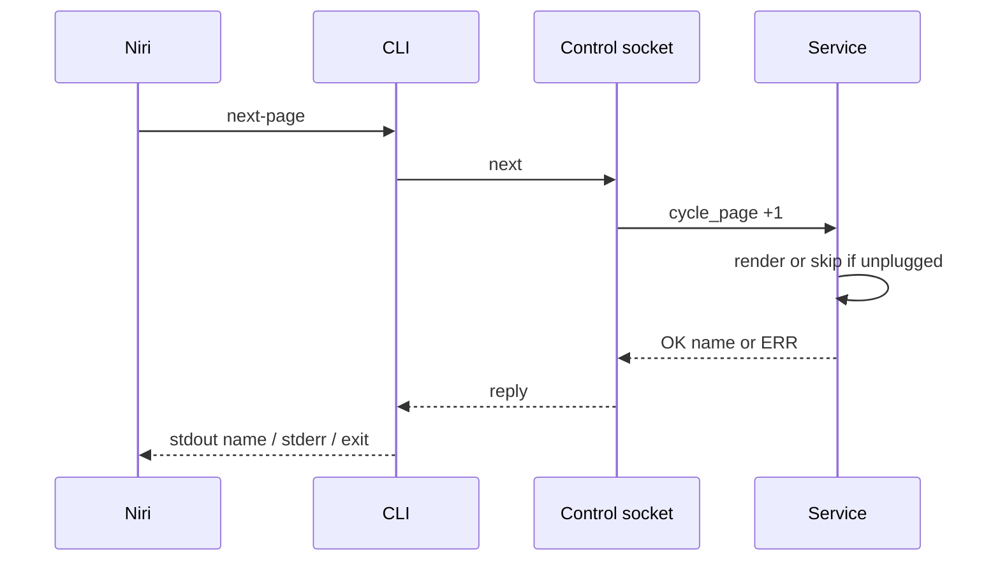
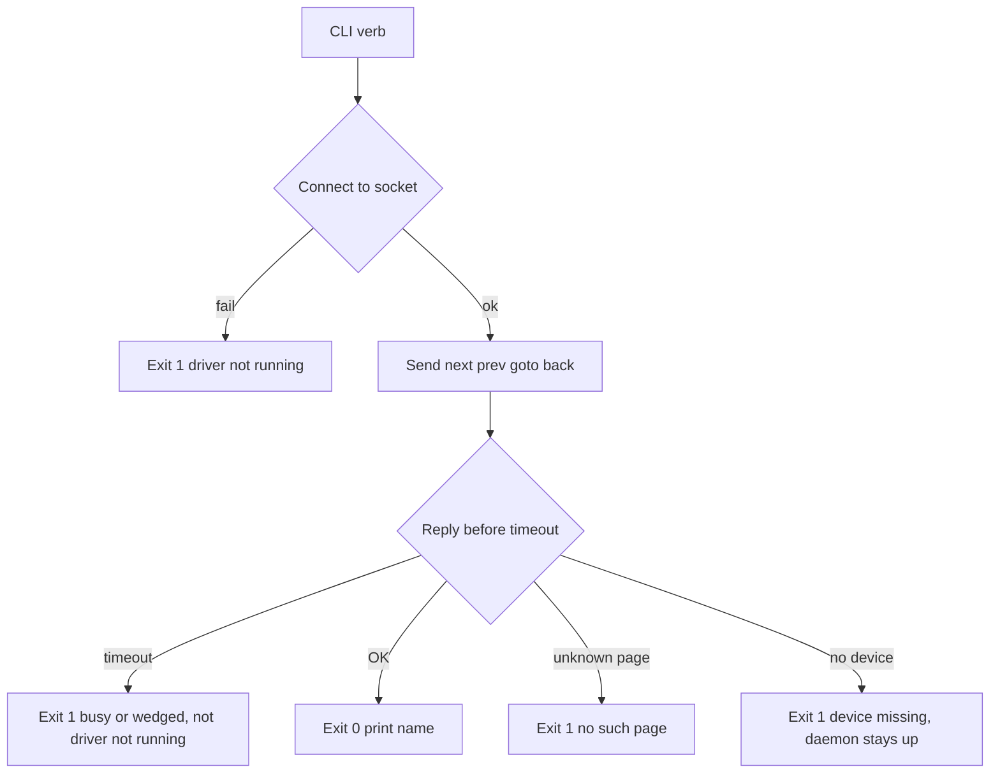

# CLI Page Commands - Plan

## Goal Capsule

- **Objective:** A D200X user can turn pages from a niri keybind or a terminal, without touching the deck, and see which page they landed on.
- **Means:** Four `ulanzi-niri` verbs that ask the already-running driver over a per-user control socket (KTD1).
- **Authority:** Product Contract owns behavior. Planning Contract KTDs own mechanism. Units cite R/KTD IDs and do not invent product rules.
- **Stop:** Do not add click, toggle, a current-page query, or one-shot HID page changes.
- **Execution:** code. Four units. Control channel, then CLI verbs, then tests, then docs.
- **Tail:** The user binding these commands in niri.

---

## Product Contract

### Summary

Add bind-first `ulanzi-niri` commands `next-page`, `prev-page`, `goto <page>`, and `back`. They change the live deck the same way the hardware page actions do. Success prints the landed page name. They talk to the running driver and fail if it is not up.

### Problem Frame

Page turning today only happens from deck buttons. The user wants niri shortcuts to call the CLI instead of reaching for the hardware. Existing one-shot CLI commands open HID themselves. That races the daemon, which already holds the device and the only copy of current page and back history.

### Key Decisions

- Bind-first verbs `next-page`, `prev-page`, `goto`, `back` (session-settled: user-directed — chosen over click-by-coordinate or toggle: niri page-turn binds this week). Governs R1, R2, R3, R4.
- Success prints the landed page name (session-settled: user-directed — chosen over silent success or from→to verbose). Governs R8.
- Same page rules as the buttons (session-settled: user-directed — chosen over walking every configured page). Governs R5, R6, R7.
- Commands ask the running driver (session-settled: user-directed — chosen over a one-shot hardware poke). Governs R9, R10, R11.

### Requirements

**Commands**

- R1. `ulanzi-niri next-page` moves to the next page.
- R2. `ulanzi-niri prev-page` moves to the previous page.
- R3. `ulanzi-niri goto <page>` jumps to that config page name.
- R4. `ulanzi-niri back` returns to the previous page in history.

**Page rules**

- R5. Next and prev wrap inside the current layer, including a one-page layer that stays put.
- R6. Goto uses the config page name. Unknown name does not change the page.
- R7. Back with nothing to return to stays on the current page.

**Feedback**

- R8. Success prints the landed page name on stdout. Errors go to stderr.
- R9. Empty-history back is success and still prints the current name.

**Live driver**

- R10. These commands ask the already-running driver. They do not open HID.
- R11. If the driver is not up, the command fails with an error distinct from HID `device not available`.
- R12. If the driver is up but the device is unplugged, the command fails, does not change page, and does not crash the driver.

**Docs**

- R13. README shows niri bind examples for the four commands.

### Key Flows

- F1. Niri bind
  - **Trigger:** niri `spawn` of `next-page`, `prev-page`, `goto <page>`, or `back`.
  - **Steps:** CLI asks the running driver. Deck matches the matching hardware page action. Stdout is unused by niri.
  - **Covered by:** R1, R2, R3, R4, R5, R10
- F2. Terminal
  - **Trigger:** User runs the same command in a shell.
  - **Steps:** Exit 0. Landed name on stdout.
  - **Covered by:** R8, R9
- F3. Driver down
  - **Trigger:** Command while `ulanzi-niri run` is not listening.
  - **Steps:** Exit 1. Stderr names the missing driver. No HID open.
  - **Covered by:** R10, R11

### Acceptance Examples

- AE1. Next in layer
  - **Covers:** F1, R1, R5
  - **Given:** Driver running. Current page has a next peer in its layer.
  - **When:** `ulanzi-niri next-page`
  - **Then:** Deck shows the next layer peer. Stdout is that page name. Exit 0.
- AE2. Goto named page
  - **Covers:** R3, R6, R8
  - **Given:** Driver running. Config has page `apps`.
  - **When:** `ulanzi-niri goto apps`
  - **Then:** Deck shows `apps`. Stdout is `apps`. Exit 0.
- AE3. Unknown goto
  - **Covers:** R6
  - **Given:** Driver running. No page named `nope`.
  - **When:** `ulanzi-niri goto nope`
  - **Then:** Page does not change. Stderr is `no such page: nope`. Exit 1.
- AE4. Empty back
  - **Covers:** R7, R9
  - **Given:** Driver running. History is empty.
  - **When:** `ulanzi-niri back`
  - **Then:** Page stays. Stdout is the current name. Exit 0.
- AE5. Driver not running
  - **Covers:** F3, R11
  - **Given:** No control listener.
  - **When:** `ulanzi-niri next-page`
  - **Then:** Exit 1. Stderr is `driver not running`. HID is not opened.

### Success Criteria

- Binding `spawn-sh "ulanzi-niri next-page"` in niri turns the live deck the same way the next-page hardware button does, and a terminal run of the same command prints the new page name.

### Scope Boundaries

- Click-by-coordinate, toggle, encoder control, and injecting a physical key press are out.
- A `current` / `status` query command is out.
- `brightness`, `push`, and `sniff` stay one-shot HID.
- D-Bus is out.

#### Deferred to Follow-Up Work

- `doctor` reporting whether the control channel is up.
- A second `ulanzi-niri run` as a hard single-instance lock.
- Listing pages or printing layer name.

### Sources

- `src/ulanzi_niri/cli.py` argparse subcommands, exit 0/1/2, `no such page:` on `render`/`push`.
- `src/ulanzi_niri/service.py` `switch_page`, `page_back`, `cycle_page`.
- `src/ulanzi_niri/pages.py` history and stay-put back.
- `src/ulanzi_niri/config.py` `cycle_target` wrap-in-layer.
- `tests/test_cli.py` parser and `main` + `capsys` pattern.
- No existing IPC. `watchfiles` config watcher is not a request channel.
- External landscape scan for CLI-to-daemon channels was unavailable this run. Unix socket is chosen from local absence of IPC plus the need for a request/response (print the landed name).

---

## Planning Contract

### Key Technical Decisions

- KTD1. **Use a pathname unix socket under `$XDG_RUNTIME_DIR`.** CLI needs a reply with the landed name. The config `watchfiles` watcher is one-way and has no request id. D-Bus needs a new runtime dependency and is already out of product scope. No new runtime dependency. Bind for the whole `run()`, beside the config watcher, not inside the HID reconnect loop. On start, probe-connect; unlink leftover only on refuse; if connect succeeds, do not bind. Cite R10, R11, R12.
- KTD2. **Dispatch to the existing Service page operations.** `cycle_page(±1)`, `switch_page(name)`, `page_back()`. Do not reimplement layer wrap or history in the CLI. Empty `page_back` is stay-put success, not an error.
- KTD3. **Page control must not assume a connected device.** `_render_current_page` today asserts `_device is not None`. Check the device before mutating page state on this path, or skip render without asserting. Unplug plus a keybind must fail the command, leave the page unchanged, and keep the listener up. Cite R12.
- KTD4. **Serialize page ops on one driver lock covering CLI, buttons, and reload.** Wait until render finishes or is skipped. Connect-fail is R11. An accepted socket that is slow is busy or wedged, not `driver not running`.
- KTD5. **CLI I/O matches existing one-shot conventions except the driver-down string.** Stdout is `{name}` plus newline. Unknown goto uses `no such page: {name}` and exit 1. Driver down / connect fail uses `driver not running` and exit 1. These subcommands do not take `--config`. Thin blocking-socket client in `cli.py`. Do not import `Service` from the CLI. Cite R8, R9, R11.

### High-Level Technical Design

Directional guidance, not implementation specification.

Control grammar is directional: one request line (`next`, `prev`, `goto <name>`, `back`) and one reply line (`OK <name>` or `ERR <reason>`). Implementer may pick framing as long as KTD5 user-facing strings stay.

On `run` start, probe the socket path. Unlink only when connect is refused. If another listener is alive, do not bind. Clean shutdown unlinks. Bind failure does not take down HID `run`; CLI then fails per R11.

### Assumptions

- `$XDG_RUNTIME_DIR` is present on the niri session. If it is missing, fail the listener the same way as bind failure.
- Timeout on the order of a couple of seconds is enough for one page render.

### Risks

- `switch_page` re-render on unplug can kill the daemon unless U1 makes that path safe (KTD3).
- A leftover socket from a crash is `ECONNREFUSED`. Unlink-then-bind without a probe would steal a live driver's path. KTD1 probe-connect is required.
- Two `run` processes still can both open HID. This plan does not add a single-instance lock.

---

## Implementation Units

### U1. Control socket and disconnect-safe page ops

- **Goal:** The running driver accepts page commands and replies with the landed name without crashing when the device is gone.
- **Requirements:** R5, R6, R7, R10, R11, R12
- **Dependencies:** none
- **Files:** `src/ulanzi_niri/service.py`, `src/ulanzi_niri/pages.py` if the control surface needs a landed-name helper, `tests/test_service.py`
- **Approach:**
  1. Bind the socket at `run()` start, before HID wait, and keep it up while unplugged (KTD1).
  2. Probe-connect then unlink-only-on-refuse. Do not steal a live listener.
  3. Map requests to `cycle_page`, `switch_page`, `page_back` (KTD2). Stay-put back is success.
  4. Make render-on-switch safe when `_device` is None (KTD3). Fail the command. Do not change page. Do not assert.
  5. Serialize page ops with one lock shared with buttons and reload (KTD4). Unlink on clean stop.
- **Patterns to follow:** `Service.switch_page` / `page_back` / `cycle_page`. Config watcher task lifetime in `Service.run`. `tests/test_service.py` in-process `Service` construction.
- **Test scenarios:**
  - In-process next from page A lands on the layer peer and returns that name.
  - Unknown goto does not switch and reports no such page.
  - Empty back stays and returns the current name.
  - `_device` is None: command fails, listener still up, page name unchanged.
  - Listener absent after `stop`.
  - Socket path with a live listener: second start does not unlink-and-steal.
- **Verification:** Service tests cover nav replies and the unplug path without opening HID.

### U2. CLI page verbs

- **Goal:** The four subcommands speak the control channel and print user-facing results.
- **Requirements:** R1, R2, R3, R4, R8, R9, R11
- **Dependencies:** U1
- **Files:** `src/ulanzi_niri/cli.py`, `tests/test_cli.py`
- **Approach:**
  1. Add `next-page`, `prev-page`, `goto`, and `back` to `build_parser`. `goto` takes a positional page name.
  2. Blocking sockets in `cli.py`. Do not `asyncio.run` and do not import `Service` (KTD5).
  3. Connect, send, print per KTD5. Do not call `open_device`. Do not add `--config`.
  4. Connect fail is `driver not running`, exit 1. Do not map an in-flight timeout to that string (KTD4).
- **Patterns to follow:** `build_parser` / `main` dispatch. `tests/test_cli.py` `parse_args` and `main` + `monkeypatch` + `capsys`. `no such page:` copy from `render`/`push`.
- **Test scenarios:**
  - Covers AE2. Parser accepts `goto apps`.
  - Covers AE5. No socket: `next-page` exits 1, stderr `driver not running`, stdout empty.
  - Fake reply `OK apps`: `goto apps` exits 0, stdout `apps`.
  - Fake reply unknown: stderr `no such page: nope`, exit 1.
  - Covers AE4. Fake stay-put back: exit 0, stdout current name.
  - `goto` without a name is argparse usage exit 2.
  - These verbs do not open HID.
- **Verification:** CLI tests pass without a real daemon. Parser help lists the four commands.

### U3. End-to-end command contract

- **Goal:** One in-process path proves a CLI verb drives Service page state.
- **Requirements:** R1, R5, R8, R10
- **Dependencies:** U1, U2
- **Files:** `tests/test_cli_page.py`
- **Approach:**
  1. Do not call `Service.run()` as production HID wait. Use the two-page `layer="home"` injection in `tests/test_service.py` `test_page_indicator_tracks_navigation_within_current_layer`.
  2. Non-finite FakeDevice so reconnect does not clear `_device`. Mock render helpers like that test.
  3. Point the CLI with `XDG_RUNTIME_DIR=tmp_path`. Run `cli.main` in a thread so it does not block the pytest-asyncio loop (KTD5).
  4. Assert stdout name and shared history on one Service instance (KTD2).
- **Execution note:** In-process listener plus threaded CLI. No subprocess `ulanzi-niri run`. No hidraw.
- **Patterns to follow:** `tests/test_service.py` page-indicator config injection and FakeDevice. `tests/test_ai_usage.py` `monkeypatch.setenv` for XDG. Keep `tests/test_cli.py` as parser/`capsys` only.
- **Test scenarios:**
  - Covers AE1. Threaded `next-page` against that service moves within the layer and prints the new name.
  - `cycle_page(1)` then threaded `back` on the same instance shares history.
- **Verification:** The new test file passes with `uv run pytest` on those tests. No device needed.

### U4. Document niri binds

- **Goal:** The user can copy a working niri spawn line.
- **Requirements:** R13
- **Dependencies:** U2
- **Files:** `README.md`
- **Approach:**
  1. Show the four commands.
  2. Show a niri `spawn` / `spawn-sh` example for next and prev.
  3. State that the daemon must be running and that success prints the page name.
- **Patterns to follow:** README Development command list and Hardware/config tone.
- **Test expectation:** none -- documentation only.
- **Verification:** README names all four commands and that the driver must be up.

---

## Verification Contract

- CLI and service tests for this change: `uv run pytest tests/test_cli.py tests/test_service.py tests/test_cli_page.py`
- Full suite: `uv run pytest`
- Lint: `uv run ruff check .`
- Types: `uv run mypy src`

U1 is proven by service listener and unplug tests. U2 is proven by CLI parser and fake-socket tests covering AE2–AE5. U3 is proven by in-process next-page plus shared-history back (AE1). U4 is proven by README review.

---

## Definition of Done

- R1–R13 are implemented and traced from U1–U4.
- AE1–AE5 pass via U2 and U3 tests.
- `ulanzi-niri next-page` with the daemon up changes the live page and prints the name.
- The same command with the daemon down exits 1 with `driver not running` and does not open HID.
- Unplug plus a page command does not crash `run`.
- README shows niri bind examples.
- `uv run pytest`, `uv run ruff check .`, and `uv run mypy src` pass.
- Abandoned-attempt code is not left in the diff.
